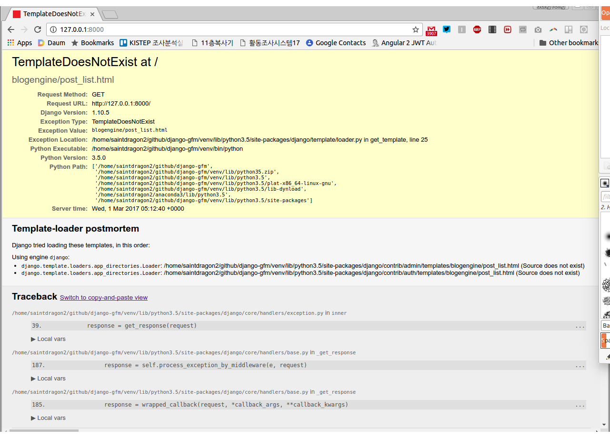
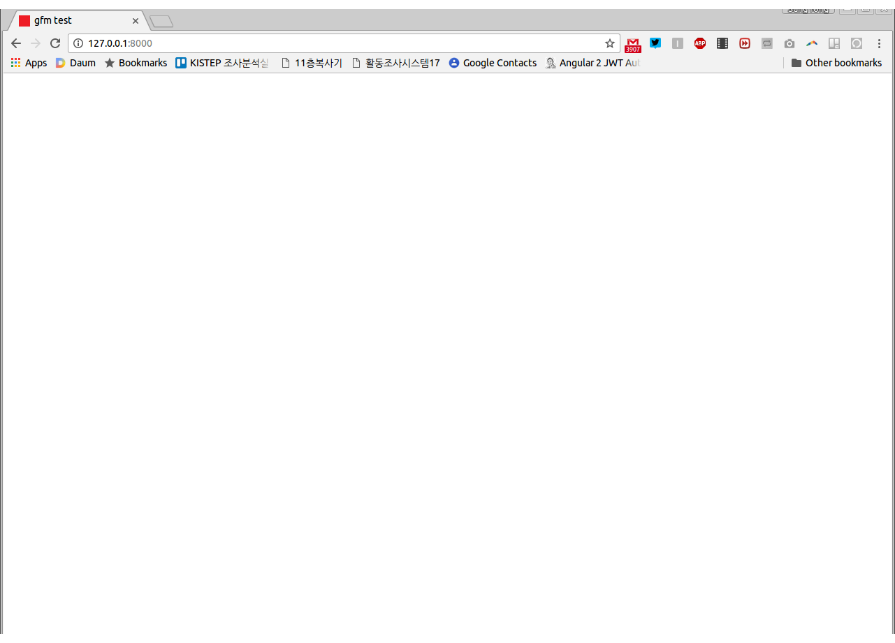
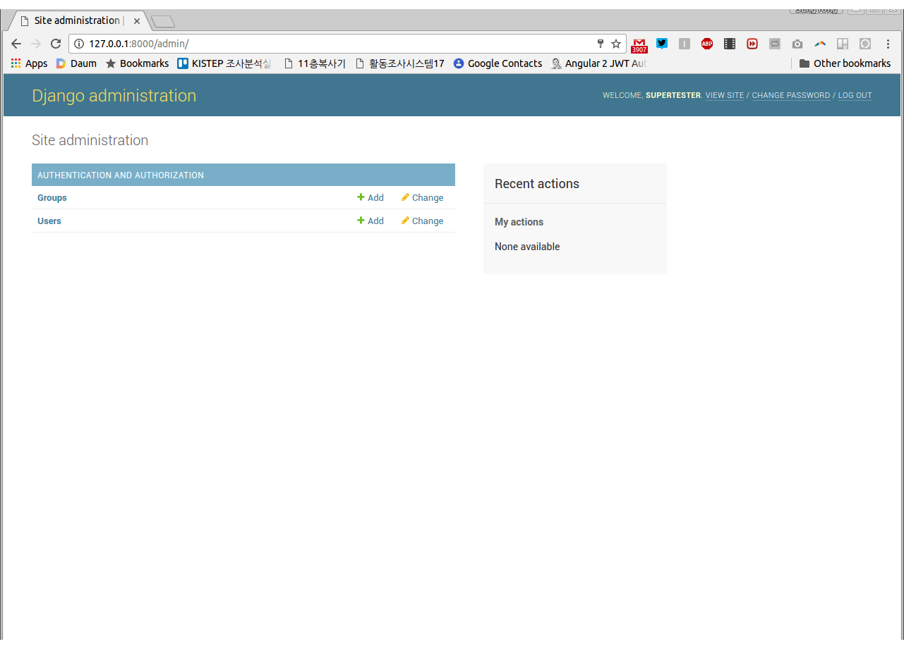
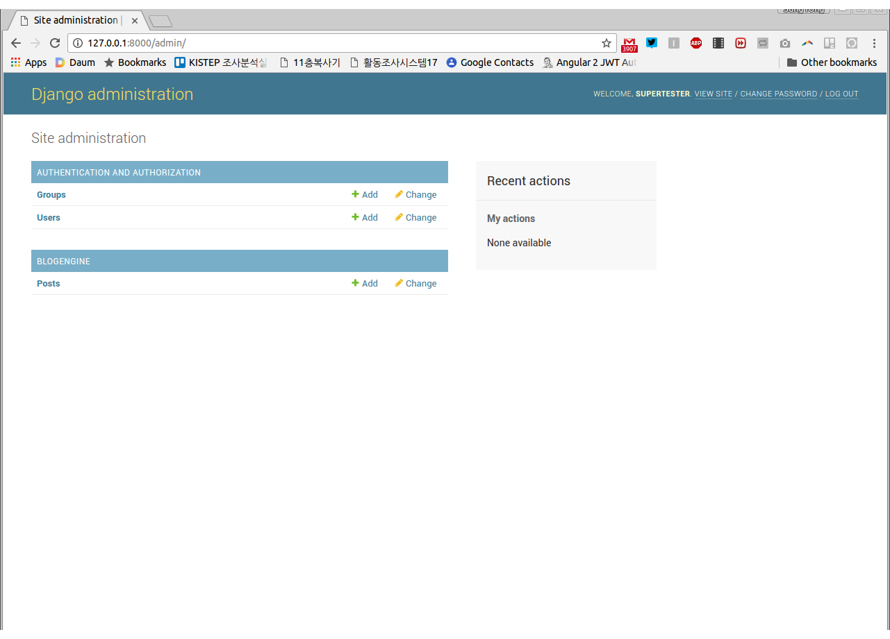
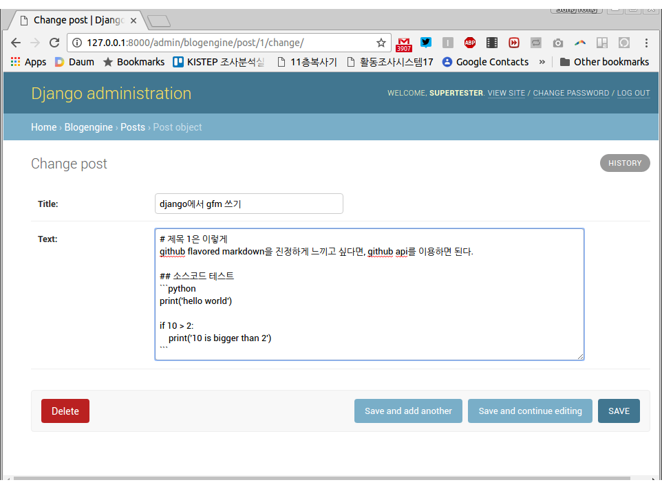
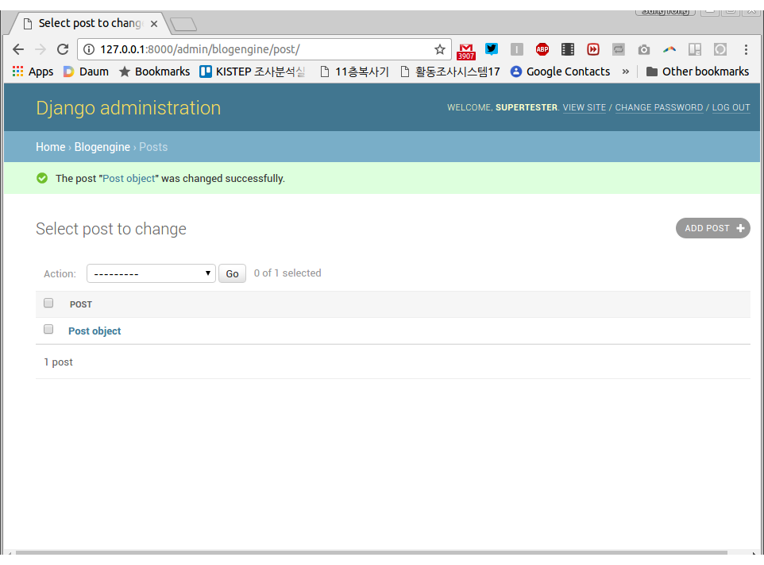
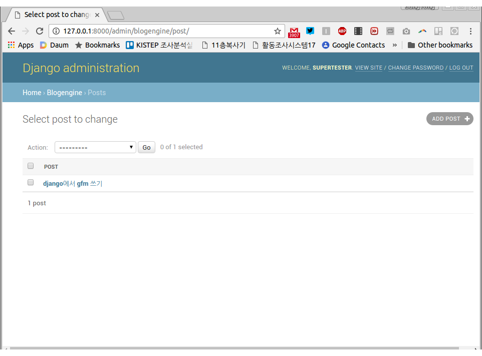
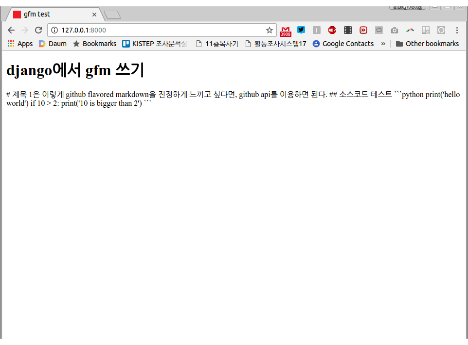
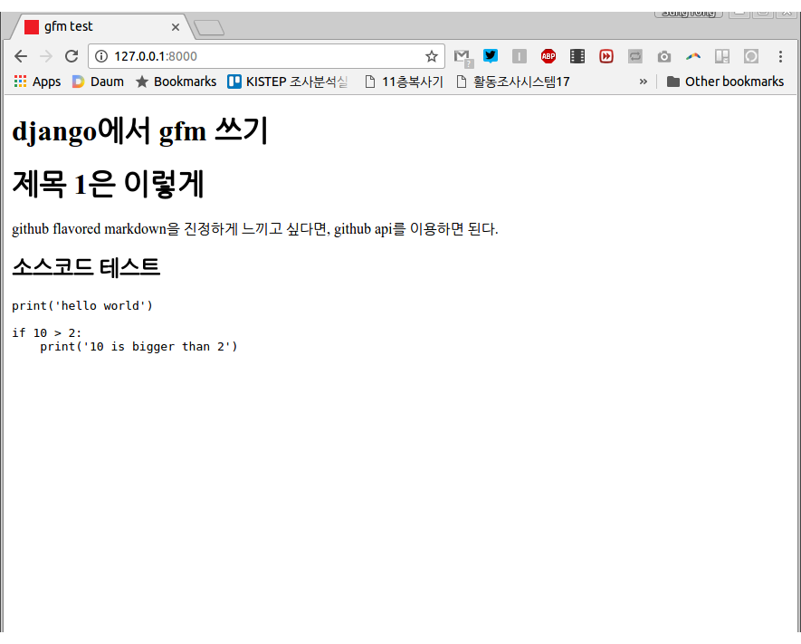
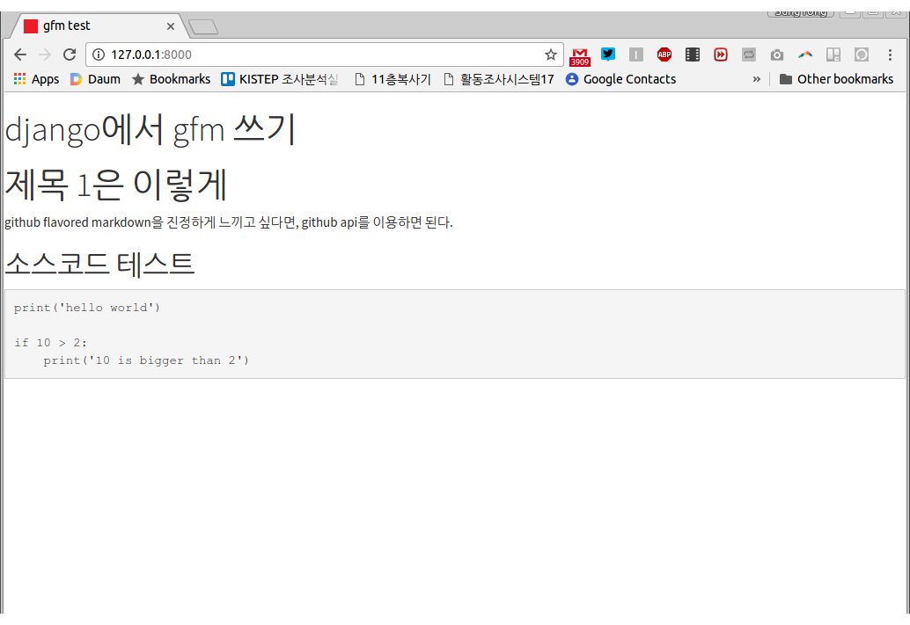

# Github API를 이용하여 django에서 Markdown문서 렌더링하기
Django를 이용해 개인 블로그를 개발하면서, Markdown 문법을 사용하기로 했다. 그런데 Markdown 문법이 조금씩 다 다르기 때문에, 어떤 parser를 쓰느냐에 따라 결과가 달라지는 문제가 있었다. 원래는 [django-markdown2](https://pypi.python.org/pypi/django-markdown2)을 사용했으나, github의 `README.md`를 작성하고 그 내용을 내가 만든 django 기반의 블로그에 옮겨 붙이면, 렌더링이 될 때 깨지고 난리도 아니었다. 

그래서 어떻게 하든, Github랑 똑같이 렌더링해주는 걸 찾아 헤맸고, Github에서 API를 제공하고 있다는 것을 알게 되었다. 

## Django 프로젝트 시작하기
언제나 django 프로젝트는 가상환경 만들기 부터! 
```
$ mkdir django-gfm
$ cd django-gfm
$ virtualenv venv
$ source venv/bin/activate
$ pip install django
```
이 문서는 ubuntu 16.04를 기반으로 작성되었다. 윈도우나 다른 환경에서 이 문서를 따라하고 있고, 위 과정을 혼자 해결할 능력이 아직 없다면, [Django Girls의 튜토리얼](https://tutorial.djangogirls.org/ko/django_installation/)을 따라하시기 바란다.

django 설치가 끝났으니, 프로젝트를 만든다. (맨 뒤에 점을 꼭 찍어주기 바란다. 점을 찍지 않으면 하위 폴더가 또 생성된다.) 그 다음, `blogengine`이라는 앱을 추가한다.  
```
$ django-admin startproject django_gfm_prj .
$ python manage.py startapp blogengine
```
`settings.py`에 `blogengine`이라는 앱을 만들었다고 알려준다. 
```python
# django_gfm_prj/settings.py
#...
INSTALLED_APPS = [
    'django.contrib.admin',
    'django.contrib.auth',
    'django.contrib.contenttypes',
    'django.contrib.sessions',
    'django.contrib.messages',
    'django.contrib.staticfiles',
    'blogengine',	# <--- add this line
]
# ...
```
## 블로그 `Post` 클래스 만들기
이제 블로그 포스트 클래스를 만들자. 실제 블로그를 만드려고 하는 것은 아니니까 `title`과 `text`만 있는 간단한 클래스를 예로 들겠다. 
```python
# blogengine/models.py
from django.db import models


class Post(models.Model):
    title = models.CharField(max_length=256)
    text = models.TextField()
```
더 그럴 싸하게 만들 수 있겠지만, 일단은 github api를 사용하는데에 목표가 있으니까, 첫 화면에서 블로그 포스트의 제목과 내용이 디스플레이 되도록 해보자. 먼저 사용자가 `127.0.0.1`로 들어왔을 떄, `blogengine`  앱 쪽에서 저리할 수 있도록 아래와 같이 수정한다. 
```python
# django_gfm_prj/urls.py
from django.conf.urls import url, include
from django.contrib import admin

urlpatterns = [
    url(r'^admin/', admin.site.urls),
    url(r'', include('blogengine.urls')),
]
```
하지만, 우리는 아직 `blogengine`쪽에 `urls.py`를 만들어 놓지 않았다. 파일을 만들고 아래와 같이 작성한다.
```python
# blogengine/urls.py
from django.conf.urls import url, include
from .views import post_list

urlpatterns = [
    url(r'^$', post_list, name='post_list'),
]
```
같은 폴더의 `views.py`파일에서 `post_list`를 import 해야하는데, `post_list`도  아직 안 만들었다. 해당 파일을 열고, 아래와 같이 수정한다. 
```python
# blogengine/views.py
from django.shortcuts import render


def post_list(request):
    return render(
        request,
        'blogengine/post_list.html',
        {
            'title': 'gfm test',
        }
    )
```
현재 상태에서 `127.0.0.1:8000`으로 접속하면 우리가 의도한 대로, `post_list` 쪽으로 오는지 확인해볼 차례다. 너무 오랫동안 테스트를 안하고 지나가면 불안하니까. 아까 `blogengine`에 `post`모델을 만들어 놓고 마이그레이션을 한번도 안했다. 터미널에서 아래와 같이 마이그레이션을 하자. 
```
$ python manage.py makemigrations
$ python manage.py migrate
```
그리고 runserver를 하면
```
$ python manage.py runserver
```
아래와 같이 성공적(?)으로 Template이 없다는 오류 화면이 뜬다. 


template을 만들자. `blogengine`폴더 아래에 `templates` 폴더를 만들고 그 밑에 또 `blogengine`이라는 폴더를 만든다. 그리고 그 아래에 `post_list.html`파일을 만든다. 그 파일을 아래와 같이 작성한다. 
```html
<!DOCTYPE html>
<html lang="en">
<head>
    <meta charset="UTF-8">
    <title>{{ title }}</title>
</head>
<body>

</body>
</html>
```
다시 브라우저를 열어보면!!!

음 여전히 안된다. 여전히 template 파일이 없다고 한다. `settings.py`를 수정하는 것을 깜빡 했다. `settings.py`파일을 수정해서, template파일들이 각 앱의 `templates`폴더에 있음을 알려준다. 
```python
# django_gfm_prj/settings.py
#...
TEMPLATES = [
    {
        'BACKEND': 'django.template.backends.django.DjangoTemplates',
        'DIRS': ['templates'],	# <-- change this line
        'APP_DIRS': True,
        'OPTIONS': {
            'context_processors': [
                'django.template.context_processors.debug',
                'django.template.context_processors.request',
                'django.contrib.auth.context_processors.auth',
                'django.contrib.messages.context_processors.messages',
            ],
        },
    },
]
#...
```
이제 다시 해보면, 잘 된다. 


## Admin페이지에서 post 작성하기
admin페이지에 들어가려면 `superuser`를 만들어야 한다. `Ctrl+c`로 돌아가고 있던 서버를 죽이고, 아래와 같이 입력한다. 
```
$ python manage.py createsuperuser
Username (leave blank to use 'saintdragon2'): supertester
Email address: super@tester.com
Password: 
Password (again): 
Superuser created successfully.
```
password는 입력을 해도 화면상 아무런 변화도 없는데, 잘 되고 있는 것이니 놀라지 말고 입력하자. 필자는 `supersuper`를 비밀번호로 입력했다. 

다시 터미널에서 `python manage.py runserver`를 입력하고, 브라우저에서 `127.0.0.1:8000/admin/`에 가서 로그인을 해보자. 

잘 되긴 했으나, 블로그가 없다. 등록하자. `blogengine/admin.py`를 아래와 같이 수정하면 된다. 
```python 
# blogengine/admin.py
from django.contrib import admin
from .models import Post


admin.site.register(Post)
```

를릭클릭하고 들어가서 post를 작성하자. 


저장 버튼을 클릭하면, 역시나 잘 된다. 그런데, 저장되고 나서 나오는 post list 화면에서 모든 객체가 똑같이 `Post object`라고 나올 모양이다. Post 모델에 `__str__`을 추가 해야겠다.  

```python
# blogengine/models.py
from django.db import models


class Post(models.Model):
    title = models.CharField(max_length=256)
    text = models.TextField()

    def __str__(self):			#<--- added this line
        return self.title		#<-- and this line
```
잘 된다!


# 첫 화면에서 포스트 보기
`post_list`에서 모든 post를 넘겨줘야 template파일에서 post를 화면에 뿌려줄 수 있다. 아래와 같이 `blogengine/views.py`를 수정한다. 
```python
# blogengine/views.py
from django.shortcuts import render
from .models import Post


def post_list(request):
    posts = Post.objects.all()			# <-- added this line
    return render(
        request,
        'blogengine/post_list.html',
        {
            'title': 'gfm test',
            'posts': posts,				# <-- and this line
        }
    )
```
이제 template파일은 `post_list.html`을 수정한다. 
```html
<!DOCTYPE html>
<html lang="en">
<head>
    <meta charset="UTF-8">
    <title>{{ title }}</title>
</head>
<body>
		<!-- added from this line -->
    <h1>{{ post.title }}</h1>
    {{ post.text }}
							<!-- to this line -->
</body>
</html>
```
잘 된다. 하지만, markdown이 적용되지는 않았다....


## Github API 이용하기
이걸 설명하기 위해 이 먼길을 왔다. 추가하는 방법은 매우 간단하다. markdown으로 작성한 text를 github api에 날리면, 거기서 html로 변환된 결과를 돌려준다. 그럼 그걸 우리 화면에 뿌려주면 되는거다. 

일단 `requests`를 설치하고, 
```
$ pip install requests
```
`models.py`에 아래 함수를 추가한다.
```python
# blogengine/models.py
from django.db import models
import requests


def md_to_gfm(text):
    headers = {'Content-Type': 'text/plain'}
    data = text.encode('utf-8')
    r = requests.post('https://api.github.com/markdown/raw', headers=headers, data=data)

    return r.text.encode('utf-8')


class Post(models.Model):
    title = models.CharField(max_length=256)
    text = models.TextField()

    def __str__(self):
        return self.title

    def gfm(self):
        return md_to_gfm(self.text)
```
그리고 마지막으로 template파일을 아래와 같이 수정하면 된다. 
```html
<!DOCTYPE html>
<html lang="en">
<head>
    <meta charset="UTF-8">
    <title>{{ title }}</title>
</head>
<body>

    <h1>{{ post.title }}</h1>
    {{ post.gfm | safe }}		<!-- changed this line -->

</body>
</html>
```
잘 되는 것 같다.

조금 더 예쁘게 하고 싶어서 https://bootswatch.com/에서 css를 하나 골랐다. 그리고 아래와 같이 적용. 
```html
...
<link rel="stylesheet" href="https://bootswatch.com/cosmo/bootstrap.min.css">
...
```
짜!잔!


## 정리하며...
맨 마지막 파트만 설명하면 되었을 것을 너무 많은 내용을 불필요하게 담은 것이 아닐까 싶다. 더 구체적인 활용방법은 여러분의 응용력에 맡기기로 하고 이쯤에서 정리한다. 
### 요약
+ django model에 textfield로 markdown 문서 저장
+ github api에 보내고 결과를 받음
+ template에서 그 결과를 받아 화면에 출력

소스코드는 github에 있다. https://github.com/saintdragon2/django-gfm